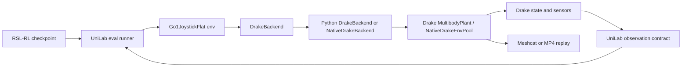

# Drake Replay Plan

Status: active working plan; replay, visualization, tracked MP4 recording, dog-only DrakeUni training smoke, native C++ pool integration, and strict MuJoCo-recipe alignment achieved
Last updated: 2026-06-12
Owner intent: replay a trained UniLab checkpoint through UniLab using a Drake backend, then grow the Go1-only path toward DrakeUni training.

## Goal

Replay the existing `Go1JoystickFlat` PPO checkpoint through UniLab with `sim_backend=drake`.

The original M0-M5 target was replay/evaluation, not training. The policy remains a PyTorch/RSL-RL checkpoint. UniLab should run the policy, send actions to Drake, step Drake physics, rebuild the UniLab observation contract from Drake state/sensors, and visualize or record the replay.

Update for the DrakeUni phase: the current target is dog-only training support for `Go1JoystickFlat`, not a generic Drake backend. The Python reference multi-env gate now has a native C++ DrakeUni pool path behind `drake_backend_mode: native`, with Go1 PPO data collection/update/checkpoint/replay running through UniLab.

Target command shape:

```bash
uv run --no-sync eval \
  --algo ppo \
  --task go1_joystick_flat \
  --sim drake \
  --load-run 2026-06-05_02-36-19_mujoco \
  --render-mode record \
  training.play_env_num=1
```

## Current Facts

- Target task is Go1, not G1.
- Target env is `Go1JoystickFlat`.
- Existing trained checkpoint:
  - `logs/rsl_rl_ppo/Go1JoystickFlat/2026-06-05_02-36-19_mujoco/model_150.pt`
- Drake is installed in the UniLab uv environment:
  - `drake==1.53.0`
  - Python: `.venv/bin/python3`, Python 3.13.12
  - `pydrake` imports successfully.
- Drake plant/simulator smoke test passes.
- Drake Meshcat smoke test passes.
- MuJoCo Go1 replay already works and can record a single-env MP4.
- Drake cannot parse the current Go1 MJCF scene as-is because the MJCF references `.stl` visual meshes.
- In the Go1 MJCF, the STL meshes are visual meshes. Collision geometry is mostly primitive box/cylinder/capsule/sphere geometry.
- A dirty Drake replay loop now loads the existing actor checkpoint, rebuilds the 49D Go1 actor observation from Drake state, and sends joint position targets to Drake's native in-plant PD controller.
- The old external torque-PD approximation collapses quickly in Drake. The Drake-native PD path keeps Go1 upright in zero-action and policy smoke tests.
- The MuJoCo-trained policy now walks forward in the dirty Drake replay after actuator-target clamping and point-contact SAP contact settings. Treat the remaining velocity difference as a sim/contact parity gap, not as backend-contract completion.
- A direct MuJoCo dirty replay using the same actor, same hard-coded `[0.5, 0.0, 0.0]` command, same observation layout, same `Kp=35/Kd=0.5`, and same action-to-target mapping walks forward. This narrows the Drake issue to physics/sensor/contact/actuator semantic parity.
- A minimal `DrakeBackend` is now registered for `Go1JoystickFlat`.
- The normal RSL-RL script path can load the MuJoCo-trained checkpoint and run finite headless Drake playback with `training.play_render_mode=auto`.
- The normal RSL-RL script path can record finite Drake MP4 playback with `training.play_render_mode=record`.
- Drake replay metadata is now parsed from the Drake model files instead of Python-side robot constants.
- The Drake backend now supports multiple Go1 envs by sharing one static Drake Diagram and keeping one independent Context/Simulator runtime per env.
- `Go1JoystickFlat` training smoke has run through UniLab/RSL-RL with Drake at `algo.num_envs=2`, `algo.num_envs=4`, the first incomplete alignment batch of `16`, the strict aligned batch of `1024`, and the native C++ pool smoke batch of `8`.
- A Drake-trained smoke checkpoint can be replayed and recorded through UniLab.
- Fresh MuJoCoUni comparison training succeeds on the same `Go1JoystickFlat` task:
  - MuJoCoUni run: `3,710,976` env steps, final mean reward `35.11`, best mean reward `39.89`.
- Strict-aligned Drake Python reference training now runs the same sample budget:
  - Drake run: `3,710,976` env steps, final mean reward `34.36`, best mean reward `42.53`.
  - Drake replay is recorded with the same tracked state-rendering path as MuJoCo playback.
- Native DrakeUni Stage 3 now routes `task=go1_joystick_flat/drake` through `drake_backend_mode: native`, using the pybind C++ `NativeDrakeEnvPool` for Go1 state/sensor stepping.
- Native mode enforces the pydrake/native libdrake process boundary and records import diagnostics instead of silently hiding ABI failures.
- Native Go1 self-collision filtering now mirrors the pydrake backend before Drake plant finalization.

## Resolved So Far

This is the current milestone boundary.

- Drake is installed and usable in the UniLab uv environment.
- Go1 can be imported into Drake through generated Drake-compatible MJCF copies and converted OBJ visual meshes.
- Drake reports the expected Go1 dimensions: `nq=19`, `nv=18`, `nu=12`.
- The MuJoCo-trained `Go1JoystickFlat` actor checkpoint loads outside UniLab.
- The dirty Drake replay reconstructs the 49D actor observation from Drake state.
- The dirty Drake replay maps actor actions to joint position targets using UniLab's contract:

```text
target_q = action * action_scale + default_angles
```

- Drake-native actuator PD is now the control direction.
- Policy-derived joint targets are clamped to MuJoCo actuator `ctrlrange`, matching MuJoCo position-actuator semantics.
- Robot self-collisions are filtered in both pydrake and native C++ Drake paths before plant finalization, matching the intended MuJoCo collision topology more closely.
- Drake point-contact SAP is selected for the dirty replay, producing much closer Go1 locomotion than the parser default.
- The dirty Drake replay visibly walks forward in Meshcat:
  - Drake dirty replay after fixes: `linvel_x=0.5923` at 6 seconds.
  - Direct MuJoCo dirty baseline: `linvel_x=0.670` at 6 seconds.
- `src/unilab/base/backend/drake/backend.py` implements the Python reference backend contract for Go1 replay and multi-env Go1 training.
- `src/unilab/base/backend/drake/native/drake_env_pool.cc` implements the first Go1-only native C++ DrakeUni pool, and `src/unilab/base/backend/drake/backend_native.py` wires it into UniLab's backend contract.
- DrakeBackend parses actuator limits, effort limits, foot site sensors, contact sensor names, and the home keyframe from `scene_flat_drake.xml` plus included robot XML.
- `Go1JoystickFlat` is registered with `sim_backend="drake"`.
- `conf/ppo/task/go1_joystick_flat/drake.yaml` selects the Drake-compatible scene, selects `env.drake_backend_mode: native`, and now follows the MuJoCo Go1 training recipe for command sampling, PPO env count, rollout horizon, iteration count, save interval, observation groups, playback env count, and camera flags.
- The unsupported contact reward scale is disabled in the Drake config until real Drake contact-force support lands.
- The remaining intentional config differences are `training.sim_backend=drake`, native Drake backend mode, the Drake-compatible `env.scene.model_file`, and omission of contact reward while contact forces are stubbed.
- Drake now accepts Go1 push interval randomization. Base mass and COM reset randomization are still skipped at runtime because the Drake backend does not support them yet.
- Headless checkpoint replay through UniLab's normal RSL-RL entrypoint runs to completion with this command:

```bash
uv run python scripts/train_rsl_rl.py \
  task=go1_joystick_flat/drake \
  training.play_only=true \
  algo.load_run=2026-06-05_02-36-19_mujoco \
  algo.checkpoint=150 \
  training.play_env_num=1 \
  training.play_steps=120 \
  training.play_render_mode=auto
```

- Meshcat playback through UniLab's playback contract works for Drake.
- MP4 playback through UniLab's playback contract works for Drake with `training.play_render_mode=record`.

## Still Open

- The Drake backend is intentionally narrow: Go1 flat only, with Python reference and native C++ pool paths.
- Drake sensor reconstruction is implemented for the Go1 joystick replay contract, not yet as a generic Drake sensor/site abstraction.
- Contact/friction parity is improved but not exact; Drake still cannot reproduce MuJoCo `condim=6`, torsional friction, rolling friction, or joint `frictionloss` exactly through MJCF parsing.
- The current native DrakeUni path is a first C++ handle pool, not yet the final high-throughput worker-context or portable packaged DrakeUni backend.
- MPI and cluster-scale data generation remain out of scope for this milestone.

## Architecture Target



## Success Criteria

Minimum success:

- `--sim drake` is accepted by the UniLab CLI and registry.
- `Go1JoystickFlat` can be instantiated with the Drake backend for `training.play_env_num=1`.
- The trained checkpoint loads.
- The policy loop runs for finite replay steps without crashing.
- Drake receives the policy action and steps the plant.
- The env returns actor observations with the expected shape `(1, 49)`.
- A visualization exists:
  - first acceptable: Meshcat interactive replay,
  - final target: `--render-mode record` produces an MP4.

Non-goals for the first replay milestone:

- MPI.
- Domain randomization parity.
- Reward/contact parity.
- Perfect MuJoCo-to-Drake behavioral match.
- Generic Drake robot support.
- Final portable native extension packaging.

## Contract To Restore

### Model Contract

For Go1 replay, Drake must expose a model equivalent enough to the MuJoCo Go1 model:

- floating base,
- 12 actuated joints,
- Go1 body and joint names recoverable,
- foot frames/sites recoverable or reconstructable,
- floor contact sufficient for replay dynamics.

Expected model dimensions from MuJoCo:

- `nq = 19`
- `nv = 18`
- `nu = 12`

### Controller Contract

The checkpoint outputs 12 normalized actions. UniLab maps these actions to joint position targets:

```text
target_q = action * action_scale + default_angles
```

For Drake, use Drake's native discrete-plant actuator PD path:

```text
desired_state = [target_q, target_v=0]
feedforward_u = 0
```

The desired state is written to `MultibodyPlant.get_desired_state_input_port(model_instance)`.
Feedforward actuation is fixed to zero through `get_actuation_input_port(model_instance)`.
Policy-derived joint targets are clamped to the MuJoCo actuator `ctrlrange` before being sent to Drake, because MuJoCo position actuators enforce that range during stepping.
The external torque-PD formula remains useful as a diagnostic path only:

```text
tau = kp * (target_q - q) - kd * qdot
```

Initial Go1 gains from UniLab:

- `kp = 35.0`
- `kd = 0.5`
- `action_scale = 0.25`
- actuator `ctrlrange`:
  - hip: `[-0.863, 0.863]`
  - thigh: `[-0.686, 4.501]`
  - calf: `[-2.818, -0.888]`

### Observation Contract

The Go1 actor observation is 49 values:

```text
gyro(3)
-gravity_or_upvector(3)
joint_position_error(12)
joint_velocity(12)
last_action(12)
command(3)
feet_phase(4)
```

For the first replay, the actor observation is more important than critic/reward observation. The critic/reward path can be minimal as long as eval playback does not crash.

Required Drake-derived quantities:

- base angular velocity in body frame for `gyro`,
- up vector or gravity direction in body frame,
- 12 joint positions in UniLab action order,
- 12 joint velocities in UniLab action order,
- foot positions for reward/diagnostics if replay path touches them,
- contact-like foot force values can be zero or approximate for dirty replay, then improved later.

### Reset Contract

Current Go1 Drake reset behavior:

- use Go1 `home` qpos equivalent,
- support randomized command sampling from UniLab,
- support Go1 interval pushes through Drake external spatial force input,
- skip unsupported base-mass and COM reset randomization until Drake-side variant/context mutation is designed.

### Visualization Contract

Two-stage plan:

- Stage A: Meshcat interactive debug, because it is easiest to prove Drake state is moving.
- Stage B: MP4 recording, ideally wired through UniLab `--render-mode record`.

## Milestones

### M0: Environment And Baseline

Status: done

- Trained Go1 MuJoCo checkpoint.
- Recorded MuJoCo single-env replay video.
- Installed and verified Drake in the UniLab uv environment.
- Confirmed Drake parsing blocker for current Go1 MJCF: STL visual meshes.

Evidence:

- `logs/rsl_rl_ppo/Go1JoystickFlat/2026-06-05_02-36-19_mujoco/model_150.pt`
- `logs/rsl_rl_ppo/Go1JoystickFlat/2026-06-05_02-36-19_mujoco/play_video_env1_replay.mp4`
- `uv pip show drake`

### M1: Import Go1 Into Drake

Status: done

Tasks:

- Created a Drake-compatible Go1 scene copy.
- Converted visual meshes from STL to OBJ.
- Kept original MuJoCo assets untouched.
- Verified Drake parser builds a plant.
- Verified model dimensions.

Gate:

```text
Drake parses Go1 scene successfully and reports nq=19, nv=18, actuated joints=12.
```

Evidence:

- Generated script: `scripts/prepare_go1_drake_assets.py`
- Generated scene: `src/unilab/assets/robots/go1/scene_flat_drake.xml`
- Generated robot XML: `src/unilab/assets/robots/go1/go1_drake.xml`
- Generated visual meshes: `src/unilab/assets/robots/go1/assets_drake/*.obj`
- Drake parse check reported:
  - `num_positions: 19`
  - `num_velocities: 18`
  - `num_actuated_dofs: 12`
  - `num_bodies: 14`
  - `num_joints: 13`
- Visual inspection:
  - Loaded the generated Drake scene in Meshcat at `http://localhost:7000`.
  - User confirmed the imported Go1 model was visible.

Notes:

- Drake still warns that several MuJoCo tags/attributes are ignored or approximated.
- Drake ignores MJCF `site`, `sensor`, and `keyframe` tags, so later backend work must reconstruct sites/sensors/keyframe state through UniLab-side code or XML parsing.
- Drake ignores MuJoCo collision filter groups and changes unsupported `condim` values to `condim=3`, so contact behavior will not be MuJoCo-identical.
- For Go1 foot contacts specifically, Drake downgrades `condim=6` to `condim=3` and ignores torsional/rolling friction. It also ignores joint `frictionloss`. These are prime suspects for the policy moving the legs without producing MuJoCo-like forward ground impulse.

### M2: Dirty Drake Replay Loop

Status: done; dirty Drake replay walks forward

Purpose: prove the policy can drive Drake before full backend cleanup.

Tasks:

- Loaded the trained RSL-RL actor manually from `actor_state_dict`.
- Built one Drake plant/context for Go1.
- Reset to Go1 home state.
- Produced the 49D actor observation from Drake state.
- Stepped policy -> action -> Drake-native PD desired joint target -> Drake.
- Clamped policy-derived position targets to MuJoCo actuator `ctrlrange`.
- Filtered robot self-collisions in Drake.
- Switched the dirty replay contact model to point-contact SAP.
- Published motion in Meshcat.

Gate:

```text
One Go1 policy replay loop runs in Drake for N steps without crashing and moves forward.
```

Evidence:

- Added dirty script: `scripts/drake_go1_dirty_replay.py`
- Headless smoke:

```bash
uv run --no-sync python scripts/drake_go1_dirty_replay.py \
  --no-meshcat --steps 60 --realtime-rate 0 --print-every 10 --hold 0
```

- Meshcat smoke:

```bash
uv run --no-sync python scripts/drake_go1_dirty_replay.py \
  --meshcat --steps 40 --realtime-rate 0 --print-every 10 --hold 0
```

- Meshcat URL reported by Drake: `http://localhost:7000`
- Verified actor checkpoint shape:
  - actor input: 49
  - actor output: 12
  - hidden dims: 512, 256, 128
- Verified Drake model order:
  - actuator order matches Go1 action order: FR, FL, RR, RL with hip/thigh/calf in each leg.
  - joint position starts are q[7:] and joint velocity starts are v[6:].
- Native PD zero-action smoke:
  - command: `uv run --no-sync python -u scripts/drake_go1_dirty_replay.py --no-meshcat --steps 100 --action-mode zero --realtime-rate 0 --print-every 50 --hold 0`
  - result after 2 seconds: `base_z=0.2542`, `linvel_x=-0.0002`, `tau_max=5.5066`
- Native PD policy smoke:
  - command: `uv run --no-sync python -u scripts/drake_go1_dirty_replay.py --no-meshcat --steps 150 --realtime-rate 0 --print-every 75 --hold 0`
  - result after 3 seconds: `base_z=0.2734`, `linvel_x=0.0552`, `action_max=2.6602`, `tau_max=16.5909`
- Native PD plus MuJoCo `ctrlrange` clamp plus point-contact SAP smoke:
  - command: `uv run --no-sync python -u scripts/drake_go1_dirty_replay.py --no-meshcat --steps 300 --realtime-rate 0 --print-every 50 --hold 0`
  - result after 6 seconds: `base_z=0.3107`, `linvel_x=0.5923`, `action_max=2.3590`, `tau_max=8.2632`
- Direct MuJoCo dirty A/B replay:
  - same actor, command, observation layout, default angles, control timestep, and `Kp=35/Kd=0.5`
  - result after 6 seconds: `base_z=0.301`, `linvel_x=0.670`, `action_max=2.376`
  - conclusion: dirty policy/control reconstruction is good enough to walk in MuJoCo; Drake's remaining failure is parity-specific.

M2 caveats:

- Drake parses Go1 MJCF position-actuator `ctrlrange` values as actuator effort limits. The dirty script overrides actuator effort limits to the MuJoCo `forcerange` values before finalizing the plant.
- The external torque-PD approximation still collapses to base contact and should be treated as a diagnostic mode, not the backend direction.
- Drake-native in-plant PD fixes the immediate collapse in zero-action and policy replay smoke tests.
- Forward velocity is now close to the MuJoCo dirty baseline but still lower, so contact/friction/damping parity remains open before judging policy quality.
- The current strongest remaining suspect is Drake physical parity, especially foot contact/friction/solver behavior and MJCF features Drake ignores or approximates. Sensor frame/sign parity should still be audited, but the same observation layout works in MuJoCo.
- No Drake MP4 recording path exists yet; Meshcat is the current visualization path.

### M3: Minimal `DrakeBackend`

Status: done

Tasks:

- Added `src/unilab/base/backend/drake/`.
- Implemented only the methods needed by `Go1JoystickFlat` replay.
- Added backend dispatch in `src/unilab/base/backend/__init__.py`.
- Allowed `drake` in `src/unilab/base/registry.py`.
- Registered `Go1JoystickFlat` with `sim_backend="drake"`.
- Added `conf/ppo/task/go1_joystick_flat/drake.yaml`.
- Preserved the M2 physics/control contracts:
  - Drake-native actuator PD,
  - MuJoCo `ctrlrange` target clamping,
  - restored Go1 actuator effort limits,
  - robot self-collision filtering,
  - point-contact SAP,
  - MuJoCo-shaped qpos/qvel at the UniLab boundary,
  - reconstructed Go1 joystick sensors.

Gate:

```text
UniLab can instantiate Go1JoystickFlat with sim_backend=drake and play_env_num=1.
```

Evidence:

- Registry smoke reports `Go1JoystickFlat` available backends include `drake`.
- Direct env smoke produced `obs=(1, 49)`, `critic=(1, 52)`, and one successful Drake step.
- Ruff check passed for the new/changed backend registration files.

### M4: UniLab Checkpoint Replay Through Drake

Status: done for headless replay; visualization still belongs to M5

Tasks:

- Ran UniLab's RSL-RL script path with `task=go1_joystick_flat/drake`.
- Loaded the MuJoCo-trained checkpoint.
- Executed headless playback for finite steps.
- Confirmed observation/action contract through the wrapper and no termination in a direct 120-step policy-loop smoke.

Gate:

```bash
uv run python scripts/train_rsl_rl.py \
  task=go1_joystick_flat/drake \
  training.play_only=true \
  algo.load_run=2026-06-05_02-36-19_mujoco \
  algo.checkpoint=150 \
  training.play_env_num=1 \
  training.play_steps=120 \
  training.play_render_mode=auto
```

Evidence:

- Script output:
  - loaded `model_150.pt`,
  - initialized Drake Go1 backend,
  - filtered `42` robot collision geometries,
  - resolved actor input `49` and critic input `52`,
  - printed `Done.` after headless playback frames.
- Direct wrapper smoke over 120 policy steps:
  - base moved by `delta_xy=[1.53087284, -0.14706941]`,
  - `terminated=[False]`,
  - obs shapes remained `{'obs': (1, 49), 'critic': (1, 52)}`.

### M5: Drake Visualization And Recording

Status: done for Meshcat playback, Drake-native RGBD capture, and tracked MP4 recording

Tasks:

- Added Drake Meshcat playback integration inside `DrakeBackend`.
- Supported `training.play_render_mode=interactive` for Drake through UniLab's playback contract.
- Kept `training.play_render_mode=auto` as finite headless playback.
- Added Drake native RGB recording with `RgbdSensor`, VTK rendering, and `mediapy.write_video`.
- Supported `training.play_render_mode=record` for finite single-env Drake replay.
- Updated generated OBJ assets to include face normals so Drake VTK can render them reliably.
- Added Drake physics-state playback snapshots.
- Routed Drake recorded playback through the same tracked MuJoCo-state renderer used by MuJoCo playback when recording from UniLab, while keeping Drake as the simulator that generates the qpos/qvel trajectory.

Interactive gate:

```bash
uv run python scripts/train_rsl_rl.py \
  task=go1_joystick_flat/drake \
  training.play_only=true \
  algo.load_run=2026-06-05_02-36-19_mujoco \
  algo.checkpoint=150 \
  training.play_env_num=1 \
  training.play_steps=1800 \
  training.play_render_mode=interactive
```

Recording gate:

```bash
uv run python scripts/train_rsl_rl.py \
  task=go1_joystick_flat/drake \
  training.play_only=true \
  algo.load_run=2026-06-05_02-36-19_mujoco \
  algo.checkpoint=150 \
  training.play_env_num=1 \
  training.play_steps=120 \
  training.play_render_mode=record
```

Evidence:

- Interactive replay printed `Drake Meshcat: http://localhost:7000`.
- Long interactive smoke ran through UniLab's normal RSL-RL path and exited with `Done.`.
- The backend reported the same Drake Go1 setup as headless playback: `42` filtered robot collision geometries and actor/critic dimensions `49`/`52`.
- Recording replay wrote:
  - `logs/rsl_rl_ppo/Go1JoystickFlat/2026-06-05_02-36-19_mujoco/play_video.mp4`
- Strict-aligned Drake checkpoint replay wrote:
  - `logs/rsl_rl_ppo/Go1JoystickFlat/2026-06-12_00-28-25_drake/play_video.mp4`
  - `1280x720`, `500` frames, `10.0` seconds, `50` FPS
- Video readback via `mediapy.read_video` reported:
  - shape `(120, 360, 640, 3)`
  - dtype `uint8`
- Extracted sample frame:
  - `/tmp/drake_record_frame30.png`
- Validation:
  - `uv run ruff check src/unilab/base/backend/drake scripts/prepare_go1_drake_assets.py`
  - `uv run python -m compileall src/unilab/base/backend/drake scripts/prepare_go1_drake_assets.py`

M5 caveats:

- Native Drake RGBD capture still uses a fixed camera.
- The normal UniLab `training.play_render_mode=record` path now uses tracked offline state rendering, so recorded comparison videos are reviewable and camera-aligned with the MuJoCo playback path.
- The tracked MP4 renderer currently relies on the Go1 MJCF-compatible visual model, so a pure URDF/SDF Drake backend would need a separate renderer or an export/materialization path.

### M6: Dog-Only DrakeUni Multi-Env Training Gate

Status: done for first Python reference training path

Purpose: prove the existing UniLab Go1 PPO training loop can collect Drake rollouts from more than one env, update a policy, write a checkpoint, and replay that checkpoint. This is still Go1-only and intentionally not a generic Drake backend.

Tasks:

- Removed the old `num_envs == 1` Drake backend restriction.
- Added one independent Drake `Context` and `Simulator` runtime per Go1 env while keeping a shared static `Diagram`.
- Preserved env 0 aliases for existing Meshcat and MP4 replay paths.
- Batched the Go1 backend contract used by `Go1JoystickFlat`:
  - `step(ctrl, nsteps)`,
  - subset `set_state(env_indices, qpos, qvel)`,
  - base pose/velocity,
  - joint position/velocity,
  - body world/body-frame helpers,
  - Go1 joystick sensor reconstruction.
- Kept reset randomization/domain randomization unsupported for Drake, matching the current dog-only config.
- Added dog-boundary regression tests for batched Go1 Drake state/query/step behavior.

Gate:

```bash
uv run python scripts/train_rsl_rl.py \
  task=go1_joystick_flat/drake \
  algo.num_envs=4 \
  algo.max_iterations=2 \
  algo.save_interval=1 \
  training.logger=tensorboard \
  training.play_steps=30 \
  training.play_render_mode=none
```

Replay gate for the new Drake-trained smoke checkpoint:

```bash
uv run python scripts/train_rsl_rl.py \
  task=go1_joystick_flat/drake \
  training.play_only=true \
  algo.load_run=2026-06-11_20-48-52_drake \
  algo.checkpoint=1 \
  training.play_env_num=1 \
  training.play_steps=30 \
  training.play_render_mode=record
```

Evidence:

- Added test: `tests/base/backend/test_drake_go1_pool.py`
- Targeted tests:
  - `uv run pytest tests/base/backend/test_drake_go1_pool.py -q`
  - result: `5 passed`
- Static checks:
  - `uv run ruff check src/unilab/base/backend/drake/backend.py tests/base/backend/test_drake_go1_pool.py`
  - `uv run python -m compileall src/unilab/base/backend/drake/backend.py tests/base/backend/test_drake_go1_pool.py`
- Replay regression:
  - MuJoCo-trained checkpoint replay through Drake recorded `logs/rsl_rl_ppo/Go1JoystickFlat/2026-06-05_02-36-19_mujoco/play_video.mp4`
- Training smoke:
  - `algo.num_envs=2`, `algo.max_iterations=1` ran to completion, wrote `logs/rsl_rl_ppo/Go1JoystickFlat/2026-06-11_20-37-54_drake/model_0.pt`, and replayed.
  - `algo.num_envs=4`, `algo.max_iterations=2` ran to completion after the reset/render fixes, reached `192` total env steps, and wrote `logs/rsl_rl_ppo/Go1JoystickFlat/2026-06-11_20-48-52_drake/model_1.pt`.
  - Recorded replay of `model_1.pt` wrote `logs/rsl_rl_ppo/Go1JoystickFlat/2026-06-11_20-48-52_drake/play_video.mp4`.
- MuJoCo-recipe alignment:
  - Drake config now uses `play_steps=500`, `play_env_num=16`, `num_envs=1024`, `num_steps_per_env=24`, `max_iterations=151`, `save_interval=100`, MuJoCo-style `obs_groups`, default command sampling, matching reward scales, and matching Go1 domain-randomization flags where backend support exists.
  - One-iteration strict-aligned smoke ran with `algo.num_envs=1024`, reached `24,576` total steps, and wrote `logs/rsl_rl_ppo/Go1JoystickFlat/2026-06-12_00-28-03_drake/model_0.pt`.
  - Full strict-aligned training ran to `model_150.pt`, reached `3,710,976` total env steps, and wrote `logs/rsl_rl_ppo/Go1JoystickFlat/2026-06-12_00-28-25_drake/model_150.pt`.

M6 caveats:

- This is not yet the high-throughput DrakeUni design. It is a Python reference path using one Drake runtime per env.
- It proves the UniLab training contract works for the dog task, not that the learned policy has converged.
- Drake physical parity and sensor/contact fidelity remain quality work before judging final policy behavior.

### M7: MuJoCoUni Comparison And Strict Alignment Baseline

Status: done

Purpose: establish whether the dog task and PPO pipeline can learn under the existing repo backend, so Drake failures can be attributed to Drake-side scale/fidelity gaps rather than a broken task.

Evidence:

- Fresh MuJoCoUni training:
  - run: `logs/rsl_rl_ppo/Go1JoystickFlat/2026-06-11_22-33-10_mujoco`
  - checkpoint: `model_150.pt`
  - total env steps: `3,710,976`
  - final mean reward: `35.1149`
  - best mean reward: `39.8948`
  - mean episode length: `1000.0`
  - training wall time: `227.45s`
- Fresh Drake aligned training:
  - run: `logs/rsl_rl_ppo/Go1JoystickFlat/2026-06-12_00-28-25_drake`
  - checkpoint: `model_150.pt`
  - total env steps: `3,710,976`
  - final mean reward: `34.3625`
  - best mean reward: `42.5309`
  - mean episode length: `926.3`
  - training wall time: `1461.76s`
- Replay videos:
  - MuJoCoUni: `logs/rsl_rl_ppo/Go1JoystickFlat/2026-06-11_22-33-10_mujoco/play_video.mp4`
  - Drake: `logs/rsl_rl_ppo/Go1JoystickFlat/2026-06-12_00-28-25_drake/play_video.mp4`

Current diagnosis:

- Training budget is now aligned: both MuJoCoUni and Drake use `1024` envs, `24` steps/env/iteration, `151` iterations, and `3,710,976` total env steps.
- Wall-clock throughput remains the main architecture gap: MuJoCoUni reached about `16.3k` env steps/sec in the fresh run, while the Python Drake reference reached about `2.5k` env steps/sec over the full run.
- The current Drake config intentionally omits the `contact` reward scale until Drake contact-force support exists. The historical MuJoCo comparison config still carries an inert `contact` scale because `_reward_contact` is not registered in `Go1WalkTask._init_reward_functions`.
- The current Drake backend returns zero vectors for Go1 foot contact sensors, while MuJoCo reports real foot contact forces. This is not the current reward-gap source because contact reward is inert, but it is a backend-fidelity gap before enabling contact reward or contact-conditioned tasks.
- Go1's Python config defaults base-mass randomization, COM randomization, and pushes for MuJoCo. Drake now stages interval pushes through external spatial forces, but still skips base-mass and COM reset randomization.
- Forced-home zero-action probe shows both backends stand similarly from the same home state, so the first failure is more likely training scale/physics-contact parity than a gross action or observation shape mismatch.
- The previous Drake failure was primarily a training-budget/config alignment issue. After strict alignment, Drake trains a functional policy in the same sample budget, but remains far slower wall-clock than MuJoCoUni.

## Risks And Decisions

### Known Risks

- Drake MJCF support is not identical to MuJoCo MJCF support.
- Joint ordering may differ. We must map by joint names, not assume array order.
- Quaternion and angular velocity conventions must be checked carefully.
- Foot contact sensors will not be identical to MuJoCo contact sensors.
- A MuJoCo-trained checkpoint may behave poorly in Drake even if the backend contract is correct.
- Drake's MJCF parser maps Go1 position-actuator `ctrlrange` metadata to effort limits; Drake backend construction must restore Go1 `forcerange` effort limits explicitly or through a Drake-specific XML rewrite.
- Drake-native PD is the current control direction. External torque PD remains a debug comparison path.

### Current Decisions

- Use Go1, not G1, for the first checkpoint replay.
- First target was replay only; current target is dog-only DrakeUni training.
- First target was single env only; current Python reference path supports multiple Go1 envs through independent Drake contexts.
- Use default UniLab command sampling for Drake training to match the existing MuJoCo Go1 recipe.
- Support Go1 interval pushes in Drake; keep base-mass and COM randomization skipped until Drake can apply them correctly.
- Start with Meshcat for visual debugging.
- Keep original MuJoCo assets unchanged.
- Use Drake-native actuator PD for the first backend implementation.
- Clamp Drake actuator position targets to MuJoCo `ctrlrange`.
- Use Drake point-contact SAP for the first Go1 replay backend attempt unless a stronger parity test says otherwise.
- Filter robot self-collisions during Drake model construction while preserving robot-floor contact.

## Dynamic Update Log

Use this section to record plan changes as we learn.

- 2026-06-06: Created initial plan. Scope is Go1 checkpoint replay through UniLab using Drake backend, starting with model import and dirty replay before full backend cleanup.
- 2026-06-06: Completed M1. Added a reproducible Go1 Drake asset preparation script, generated OBJ visual meshes and Drake XML copies, and verified Drake parses the generated scene with expected Go1 dimensions.
- 2026-06-06: Accepted M1 after Meshcat visual inspection of the imported Drake Go1 model.
- 2026-06-06: Completed M2 gate. Added `scripts/drake_go1_dirty_replay.py`, loaded the MuJoCo-trained Go1 actor, reconstructed the 49D observation from Drake state, stepped policy actions through a PD torque loop, and smoke-tested Meshcat playback. Caveat: current Drake approximation collapses quickly, so control/contact parity remains open.
- 2026-06-07: Switched dirty replay from external torque PD to Drake-native in-plant actuator PD. Zero-action replay now stands stably around `base_z=0.254` after 2 seconds, and policy replay stays upright through smoke tests. Remaining caveat is locomotion parity, not immediate collapse.
- 2026-06-07: Ran a direct MuJoCo dirty A/B replay with the same actor/command/observation/action mapping. MuJoCo reaches `linvel_x=0.670` by 6 seconds, while Drake stays near zero. This points to Drake parity, not a broken actor loop.
- 2026-06-07: Rechecked Drake parser warnings. Prime parity suspects are ignored collision filter groups, foot `condim=6` downgraded to `condim=3`, ignored torsional/rolling friction, and ignored joint `frictionloss`.
- 2026-06-07: Patched dirty Drake replay to always filter robot self-collisions, clamp policy-derived position targets to MuJoCo actuator `ctrlrange`, and use Drake point-contact SAP. Drake forward replay improved to `linvel_x=0.592` by 6 seconds, close to the direct MuJoCo dirty baseline `0.670`.
- 2026-06-07: User visually confirmed the improved Meshcat replay. Marked M2 as the first successful Drake replay milestone: the checkpoint-driven dirty Drake Go1 replay walks forward.
- 2026-06-07: Completed M3. Added a minimal single-env Go1 `DrakeBackend`, backend dispatch, registry support, Go1 task registration, and a Drake-specific PPO task config.
- 2026-06-07: Completed headless M4 smoke. UniLab's normal RSL-RL script loads `model_150.pt`, constructs `DrakeBackend`, and runs 120 headless playback frames to `Done.` with `training.play_render_mode=auto`.
- 2026-06-08: Completed the Meshcat half of M5. `DrakeBackend` now rebuilds its single-env Drake diagram with `MeshcatVisualizer` only when `training.play_render_mode=interactive` is requested. A long UniLab RSL-RL replay printed `Drake Meshcat: http://localhost:7000` and completed with `Done.`.
- 2026-06-08: Completed the first MP4 half of M5. `DrakeBackend` now supports `training.play_render_mode=record` by rebuilding with a Drake RGBD camera and VTK renderer, recording frames, and writing `play_video.mp4` with `mediapy`. The generated OBJ assets now include face normals for VTK rendering.
- 2026-06-10: Removed Python-side robot constants from `DrakeBackend`. Replay metadata now comes directly from the Drake model files: position actuator `ctrlrange`, `forcerange`, joint ranges, foot `framepos` site sensors, contact sensor names, and the `home` keyframe.
- 2026-06-11: Completed the first dog-only Python DrakeUni reference training gate. `DrakeBackend` now supports multiple Go1 envs through independent Drake contexts/simulators, targeted Go1 pool tests pass, 2-env and 4-env PPO training smokes run to completion, and the 4-env Drake-trained checkpoint records an MP4 replay.
- 2026-06-11: Ran a fresh MuJoCoUni comparison training and replay. The same dog task learns under MuJoCoUni (`final_mean_reward=35.11`, `episode_length=1000`) while the first Drake alignment attempt stalls (`final_mean_reward=5.52`) because it still used a smaller Python reference batch.
- 2026-06-12: Completed strict MuJoCo recipe alignment for the Drake Go1 path. Drake now trains with `1024` envs, `24` steps/env, `151` iterations, `3,710,976` total env steps, and matching playback/camera config. The strict Drake run reached `final_mean_reward=34.36`, `best_mean_reward=42.53`, and recorded a tracked MP4 replay at `logs/rsl_rl_ppo/Go1JoystickFlat/2026-06-12_00-28-25_drake/play_video.mp4`.

## Next Action

Choose the next DrakeUni design target. The leading choices are: implement real Drake foot contact sensors and contact-force observation parity, add Drake-side base-mass/COM randomization, or begin the real `DrakeEnvPool` abstraction with explicit state/sensor buffers and a C++/pybind path, using the current Python multi-env Go1 backend as the correctness oracle.
