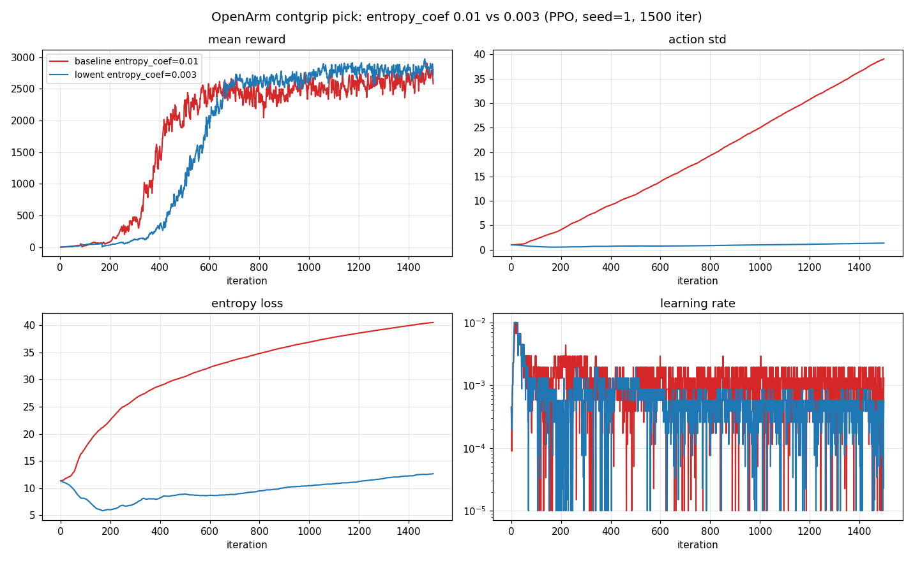
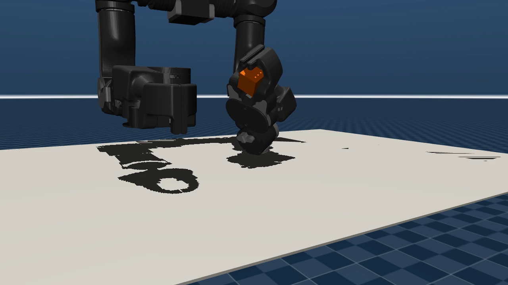

# OpenArm 拾取

本页介绍已提交的 OpenArm 单臂拾取任务：如何训练、如何评估、如何录制回放视频。
通过 `--task` 和 `--sim` 选择后端；不要单独覆盖 `training.sim_backend`。owner YAML
始终是哪些组合被配置的内部证据。

任务使用已注册的 env `OpenArmDemoPick`（`@registry.env("OpenArmDemoPick",
sim_backend="mujoco")`，见 `src/unilab/envs/manipulation/openarm/pick_place_demo.py`）。
当前只提交了 MuJoCo owner 路径；没有 Motrix owner。左臂被固定为唯一可动臂
（`left_arm_only`、`rigid_freeze_right_arm`、`fix_lifter`），策略控制左臂 7 个关节加
夹爪。

## Owner 配置

config group 为 `openarm_demo_pick`，owner YAML 全部在
`conf/ppo/task/openarm_demo_pick/` 下：

| 文件 | `--profile` | 说明 |
| --- | --- | --- |
| `mujoco.yaml` | （无） | base 拾取任务，被各变体继承；单独训练意义不大 |
| `mujoco_lift3d.yaml` | `lift3d` | 主任务：3cm 方块、空中 3D 目标、binary gripper、proximity-gated dense lift |
| `mujoco_lift3d_easy.yaml` | `lift3d_easy` | 课程/调试用：目标更低更宽（`goal z 1.13→1.09`、`success_dist 0.05→0.06`） |
| `mujoco_lift3d_contgrip.yaml` | `lift3d_contgrip` | 连续夹爪变体：策略连续闭合夹爪，配 staged + firm grasp shaping |
| `mujoco_lift3d_contgrip_lowent.yaml` | `lift3d_contgrip_lowent` | 与 contgrip 任务/reward 完全相同，仅把 `entropy_coef` 0.01→0.003：消除后期 `action std`/`entropy` 单调漂移，成功率持平/略升（详见文件内对照记录） |

顶层 CLI 通过 `--profile` 选择变体：`--task openarm_demo_pick --sim mujoco
--profile lift3d_contgrip` 会组合 owner `openarm_demo_pick/mujoco_lift3d_contgrip`。

## 训练

训练连续夹爪主变体（无渲染）：

```bash
uv run train --algo ppo --task openarm_demo_pick --sim mujoco \
  --profile lift3d_contgrip training.no_play=true
```

binary gripper 的 lift3d 主任务、以及更易上手的 easy 变体：

```bash
uv run train --algo ppo --task openarm_demo_pick --sim mujoco \
  --profile lift3d training.no_play=true
uv run train --algo ppo --task openarm_demo_pick --sim mujoco \
  --profile lift3d_easy training.no_play=true
```

owner 默认 `max_iterations: 1500`、`num_envs: 4096`。run 落在
`logs/rsl_rl_ppo/OpenArmDemoPick/<timestamp>_mujoco/`。

## 录制回放视频

`eval` 路线会以 `play_only=true` 进入回放；在无头机器上 `play_render_mode` 默认
解析为录制，视频写到该 run 目录下的 `play_video.mp4`。`--load-run -1` 取最新 run：

```bash
uv run eval --algo ppo --task openarm_demo_pick --sim mujoco \
  --profile lift3d_contgrip --load-run -1
```

owner YAML 已为该任务设好回放参数：`play_video_fps: 5`（50 Hz 物理下约 10x 慢动作，
便于观察抓取）、`play_hide_geom_groups: [3]`（隐藏 cell 外壳网格，避免遮挡机械臂）、
`play_steps: 200`、以及相机位姿。可在命令行用 `training.play_steps=300` 等覆盖。

## 评估指标

顶层 `eval` 只回放在录像里的单一相机 env。要在大量并行 env 上拿到客观拾取指标，
用 `scripts/eval_openarm_success.py`：它加载 checkpoint，把确定性策略 rollout 到很多
env（不渲染），报告曾经成功率、最终保持成功率、掉落率、最终方块高度、抓取闭合度
以及 staged-grasp 依从度。`eval_envs` 不在 schema 中，需用 `+` 追加：

```bash
HIP_VISIBLE_DEVICES=0 uv run scripts/eval_openarm_success.py \
  task=openarm_demo_pick/mujoco_lift3d_contgrip \
  algo.load_run=logs/rsl_rl_ppo/OpenArmDemoPick/<run>_mujoco \
  +training.eval_envs=512 training.play_steps=200
```

## 辅助脚本

- `scripts/openarm_scripted_pick.py`：非 RL 的脚本化分阶段拾取（APPROACH → DESCEND →
  CLOSE → LIFT），用左臂 Jacobian（`openarm_left_tcp` site）做阻尼最小二乘 IK，走与
  策略相同的 `run_playback_mode` 管线，无需 checkpoint，可生成干净的对照演示视频。

  ```bash
  MUJOCO_GL=egl HIP_VISIBLE_DEVICES=0 uv run scripts/openarm_scripted_pick.py \
    task=openarm_demo_pick/mujoco_lift3d_contgrip training.play_steps=260
  ```

- `scripts/verify_openarm_play_motion.py`：在物理 rollout 中校验左臂关节确有运动
  （env 0），用于回归检查"策略不动臂"的退化情况。

  ```bash
  HIP_VISIBLE_DEVICES=0 uv run scripts/verify_openarm_play_motion.py \
    --run-dir logs/rsl_rl_ppo/OpenArmDemoPick/<run>_mujoco --steps 120
  ```

## 训练结果与曲线对比

`lift3d_contgrip_lowent`（`entropy_coef=0.003`）相对 baseline `lift3d_contgrip`
（`entropy_coef=0.01`）的对照（PPO，seed=1，4096 env × 24 steps × 1500 iter ≈
1.47 亿步）：

| 指标 | baseline 0.01 | lowent 0.003 |
| --- | --- | --- |
| ever success（512 env 确定性 eval） | 98.8% | 100.0% |
| final success | 86.3% | 87.9% |
| drop rate | 0% | 0% |
| 最终 reward | 2580 | 2800 |
| 最终 `action std` | 39.08 | 1.35 |
| 最终 `entropy loss` | ~40（单调爬升） | ~12（平稳） |

把 `entropy_coef` 从 0.01 降到 0.003，消除了任务解出（iter ~600）之后 PPO 因 tanh
饱和而"白拿熵奖励"导致的 `action std` / `entropy` 单调漂移，训练曲线更干净，且确定性
成功率持平/略升（评估只用策略均值，不受探索噪声影响）。代价是早期到平台约晚 ~150 iter。



学到的抓取是稳定的开指托举（fingertip-cradle，闭合度 ≈ 0）；对该高摩擦小方块几何，
开指托举是更鲁棒的最优解：



关于分类级别的任务页面，参见 {doc}`../4-tasks/3-manipulation`。
